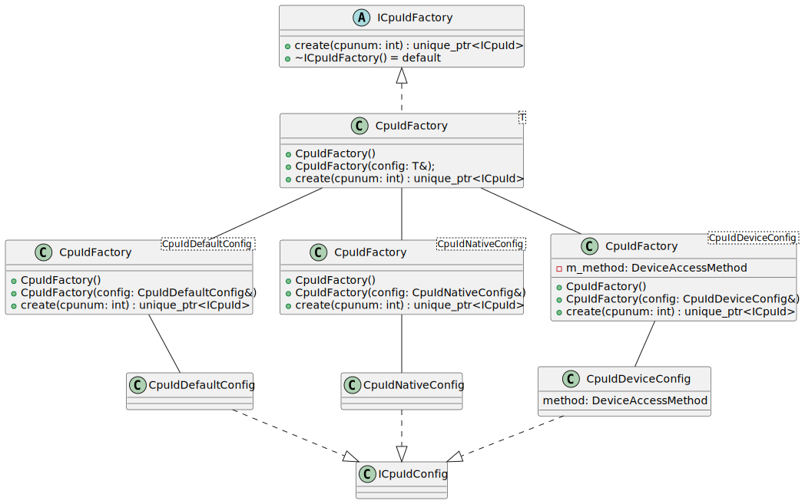

# Design of the CPUID classes and their Factories <!-- omit in toc -->

There are multiple ways to read CPUID data. For x86 platforms, there's always
the most reliable mechanism using the CPUID instruction. The CPUID instruction
returns different data depending on the core that the OS scheduled the thread.

On Linux, there is also the kernel module `cpuid`, which is loaded via the
command `modprobe cpuid`. This presents a number of files in `/dev/cpu/N/cpuid`
which can be seeked to and read with 16-byte chunks to read the same data. This
is independent of the current thread the CPU is running on when the read
operation takes place.

As such, there are multiple ways which one can obtain the results of the `cpuid`
instruction, we should implement many of them and compare them for correctness.

- [1. The CPUID classes](#1-the-cpuid-classes)
  - [1.1. The Default Reader](#11-the-default-reader)
  - [1.2. The Native Reader](#12-the-native-reader)
  - [1.3. The Device Reader](#13-the-device-reader)
  - [1.4. Further Readers](#14-further-readers)
  - [1.5. Readers and UML](#15-readers-and-uml)
- [2. The CPUID Factory Pattern](#2-the-cpuid-factory-pattern)
  - [2.1. Template Design](#21-template-design)
  - [2.2. Benefits of a Template Design](#22-benefits-of-a-template-design)
    - [2.2.1. Run-time Factory Instantiation](#221-run-time-factory-instantiation)
    - [2.2.2. Template Specialisations](#222-template-specialisations)
    - [2.2.3. Warning for Template Specialisation](#223-warning-for-template-specialisation)

## 1. The CPUID classes

### 1.1. The Default Reader

The default reader simply returns a `CpuIdRegister` object that is invalid. This
is useful for testing.

### 1.2. The Native Reader

The native reader pins the current thread on a specific CPU via the Operating
System and executes the `cpuid` instruction, returning the results.

### 1.3. The Device Reader

The device reader opens the device node `/dev/cpu/N/cpuid` and uses the
semantics defined by Linux to get the information.

### 1.4. Further Readers

Further readers may be implemented which can read prerecorded data from a file
in various formats. This is not currently implemented, but the design makes it
simple and robust to extend with further implementations.

### 1.5. Readers and UML

Each `CpuId*` class derives from `ICpuId`. This allows a polymorphic mechanism
to provide any code with a way to get CPUID information, regardless of how it is
obtained, including test code or simulation, and different ways to use a device
to exercise its APIs.

 

The `ICpuId` base class also forms the basis for a factory pattern.

## 2. The CPUID Factory Pattern

Each `ICpuId` derived object only represents a single CPU. Systems today have
typically 2 or more CPUs. Classes should be able to instantiate the objects as
needed through a CPUID *factory*.

The general design:

 

### 2.1. Template Design

One will notice that the implementation is based on *templates*. There is
effectively one factory per type that we can generate. The factory chosen is
based on a configuration type, which may be an empty type (similar to a C++ type
tag), or may contain details that are used to construct the specific type
derived from `ICpuId`.

 

The template type is a configuration parameter, which the factory then uses to
know how to construct the objects.

There is one configuration class per cpuid class. This tags the correct
specialisation, as well as allowing source compatible extensions to be applied
for customising further behaviour of the factories.

For example, the current implementation of `CpuIdNative` pins the current thread
to the CPU chosen in the `create` method. One might want to extend the
configuration class `CpuIdNativeConfig` to set the priority of the thread, which
can be done by extending the configuration class and the specialisation for
`CpuIdFactory<CpuIdNativeConfig>`.

### 2.2. Benefits of a Template Design

The template design was chosen to improve the compile type checking (static
checks) during the compilation phase.

#### 2.2.1. Run-time Factory Instantiation

In a typical run-time factory, the factory needs to take a type to be told what object it should instantiate. This could be a string (weak coupling), or an enumeration class (strong coupling).

Weak coupling would make it easy to extend behaviour by reducing the total
number of modifications required (the factory checks the string, then
instantiates the correct type). A factory can still be implemented to do this.
If the string (representing the type of `CpuId*` object to create) is unknown, a
default class can be instantiated, `nullptr`, or an error could be returned.

Strong coupling requires extending an `enum class` with the object, in addition
to modifying the class. This has the advantage that the objects are well known
and avoids spelling mistakes in the `string` case. But still, if the enum is
extended but the factory is not, a default class, `nullptr` or an error should
be returned (the `default` case of a `switch` statement, which should otherwise
be dead code).

In both these cases, the factory must be extended and told about all new classes
it can create, before a client can use that factory.

#### 2.2.2. Template Specialisations

The template specialisations reduce the number of files that need to be modified
by adding new types of objects.

When creating a new `cpuid` type, one needs to create:

* A new `CpuId*Config` object, that describes the parameters that the user can
  provide. This should derive from `ICpuIdConfig`
* A new specialisation.
  * If it requires private state, the template class declaration must be in the
    header file. Otherwise, the implementation can be completely in the source
    files.
  * The compilation units can provide the implementation for the factory
    specialisation, that ultimately instantiates the `ICpuId` object and returns
    it via `unique_ptr<CpuId*>`.

Then no modifications to any existing factories are required. If a particular
factory is not required, it simply doesn't need to be compiled. If it is used, a
linker error will result as the concrete specialisation implementation is
missing.

The compiler maps the configuration `CpuId*Config` to the template
specialisation `CpuIdFactory<CpuId*Config>`. When it is used, the linker sees
that the concrete implementation has been provided in another compilation unit.
This is why each `CpuId*` type must have a corresponding `CpuId*Config`.

As observed, if anything is forgotten, a compiler error would result. This
provides high reliability that the software which is written is probably
correct, without having to modify unrelated files. The original factory template
doesn't need to be extended and implementation is flexible. Your code only
contains the implementations it needs.

#### 2.2.3. Warning for Template Specialisation

When implementing a template specialisation, the complete memory layout must be
known to the client code using the specialisation. That means, if the factory
must keep a copy of the configuration, or external data, the private details
must be available as a private member in a public header.

Not doing so will not result in a compiler error (each unit is well defined), and
is unlikely to result in a linker error (it may, depending on the compiler, but
the author did not experience any warnings). At worst result in a memory
corruption at run time (as the author observed). The memory corruption arises
from the fact that the client is using an object of type `CpuIdFactory<X>` which
is different to the object type that might be specialised in a specific
compilation unit not accessible to the client.

In these cases, the Address Sanitiser and unit test cases can help to identify
these types of issues.
