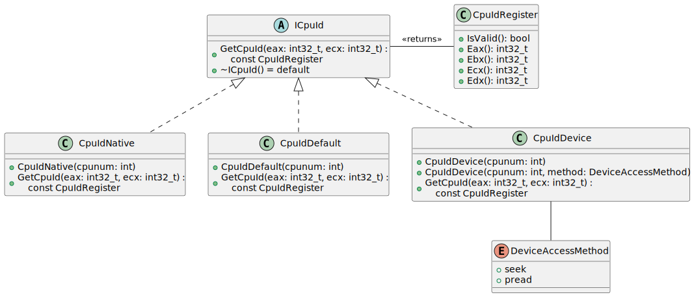
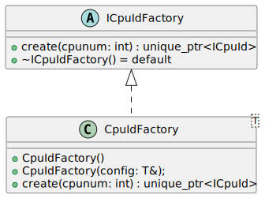
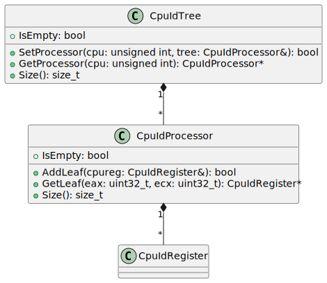

# Design of the CPUID classes and their Factories <!-- omit in toc -->

There are multiple ways to read CPUID data. For x86 platforms, there's always
the most reliable mechanism using the CPUID instruction. The CPUID instruction
returns different data depending on the core that the OS scheduled the thread.

On Linux, there is also the kernel module `cpuid`, which is loaded via the
command `modprobe cpuid`. This presents a number of files in `/dev/cpu/N/cpuid`
which can be seeked to and read with 16-byte chunks to read the same data. This
is independent of the current thread the CPU is running on when the read
operation takes place.

The OS is responsible for mapping it's processor affinity map to specific CPUs,
and it may change with different reboots. This means the ACPI core identifiers
and the topologies may not be consistent for an OS thread between cores, even if
it is pinned via setting the process affinity to a particular core.

As such, there are multiple ways which one can obtain the results of the `cpuid`
instruction, we should implement many of them and compare them for correctness.

- [1. The CPUID classes](#1-the-cpuid-classes)
  - [1.1. The Default Reader *CpuIdDefault*](#11-the-default-reader-cpuiddefault)
  - [1.2. The Native Reader *CpuIdNative*](#12-the-native-reader-cpuidnative)
  - [1.3. The Device Reader *CpuIdDevice*](#13-the-device-reader-cpuiddevice)
  - [1.4. Further Readers](#14-further-readers)
- [2. The CPUID Factory Pattern](#2-the-cpuid-factory-pattern)
  - [2.1. Template Design](#21-template-design)
  - [2.2. Benefits of a Template Design](#22-benefits-of-a-template-design)
  - [2.3. Simplest Extension on Current Design](#23-simplest-extension-on-current-design)
- [3. The CPUID Tree](#3-the-cpuid-tree)
  - [3.1. The CpuIdTree](#31-the-cpuidtree)
  - [3.2. Writing the Tree as XML](#32-writing-the-tree-as-xml)

## 1. The CPUID classes

The base abstract class is `rjcp::cpuid::ICpuId`. All CPUID readers in this
section derive from this class.

 

The `ICpuId` base class also forms the basis for a factory pattern.

### 1.1. The Default Reader *CpuIdDefault*

The default reader simply returns a `CpuIdRegister` object that is invalid. This
is useful for testing.

### 1.2. The Native Reader *CpuIdNative*

The native reader pins the current thread on a specific CPU via the Operating
System and executes the `cpuid` instruction, returning the results. Pinning the
current thread to read the CPUID natively depends on Operating System specific
functions.

### 1.3. The Device Reader *CpuIdDevice*

The device reader opens the device node `/dev/cpu/N/cpuid` and uses the
semantics defined by Linux to get the information. It assumes there is one
device per hardware thread.

Under Linux, the device driver must be explicitly loaded.

### 1.4. Further Readers

Further readers may be implemented which can read prerecorded data from a file
in various formats. This is not currently implemented, but the design makes it
simple and robust to extend with further implementations.

For example, testing has a `CpuIdSimulation` object, which returns predetermined
CPUID information from a `CpuIdTree`.

## 2. The CPUID Factory Pattern

Each `ICpuId` derived object only represents a single CPU. Systems today have
typically 2 or more CPUs. Classes should be able to instantiate the objects as
needed through a CPUID *factory*. Further, the factory should be configurable to
create *how* to obtain the CPUID information, by instantiating the appropriate
`ICpuId` derived class.

The general design:

 

The factory class itself is a private detail, and not exposed publicy, only the
`ICpuIdFactory` and the free function `CreateCpuIdFactory`.

### 2.1. Template Design

Instantiation of the `ICpuIdFactory` is done with the templated free function
`CreateCpuIdFactory()`. The input to the free function is a configuration object
that can be used through *specialisation* to create the correct concrete factory
implementation.

There is one configuration class per concrete implementation of `ICpuId`. The
configuration tags the correct specialisation, as well as allowing source
compatible extensions to be applied for customising further behaviour of the
free function specialisations. The specialisations are provided in the file
`lib/cpuid/cpuid_factory.cpp`.

### 2.2. Benefits of a Template Design

The template design was chosen to take advantage of build time checking. If the
software builds, it is likely correct.

When adding a new concrete class derived from `ICpuId`, one must only provide a
new specialisation of `CreateCpuIdFactory`, the configuration class from
`ICpuIdConfig` and the factory from `ICpuIdFactory`. Note, that no changes are
strictly necessary to existing code, making extending the code local and
potentially avoiding a common bug of forgetting to extend "parent" classes.

### 2.3. Simplest Extension on Current Design

It is not a requirement, but the simplest way to create a new mechanism to
obtain CPUID data is to:

* Create a new concrete class derived from `ICpuId` in a new `.h` and `.cpp`
  file. See `cpuid_default.h` and `cpuid_default.cpp` as an example. This is
  also done in the test code with `CpuIdSimulation`.
* Create a new configuration type. If there's nothing to configure, the
  configuration type is still needed, as the type will be used by the factory
  method to determine which object to instantiate. For example, see
  `CpuIdSimulationConfig`. This configuration type derives from `ICpuIdConfig`,
  although C++17's template system doesn't need this.
* Create a new specialisation of `CreateCpuIdFactory`. It should be in its own
  private file, no header is required. Define also the specialised template
  function `CreateCpuIdFactory` in the same file.  As it defines a concrete
  specialisation of the public templated `CreateCpuIdFactory`, it will be linked
  in as required. See also `CpuIdSimulationFactory` for an example.

## 3. The CPUID Tree

The CPUID tree is an in memory representation that can be enumerated that
contains a sorted list, for each CPU, each input CPUID EAX, ECX and its output.
This allows an in memory query for data that has already been queried, without
having to reschedule the current thread on a particular CPU, assuming the
results of the CPUID instruction is static (which is to be expected, unless a
CPU goes online, or offline).

The relationships of the tree are:

 

### 3.1. The CpuIdTree

The CpuIdTree is a container. Each element in the tree represents a CPU
`CpuIdProcessor`. Each `CpuIdProcessor` contains a unique result.

To build the tree, one creates a `ICpuIdFactory` object as described above,
using the free function and giving it the configuration on how to create
`ICpuId` objects. Then per CPU, one obtains the CPUID information, and assigns
them to the same instance of a `CpuIdProcessor`. Finally, for each CPU, it is
assigned to the `CpuIdTree`.

A free function `GetCpuId(factory: ICpuIdFactory&):
std::unique_ptr(tree::CpuIdTree>` will do this for you, following the standards
given by the Intel and AMD manuals for obtaining the CPUID information.

### 3.2. Writing the Tree as XML

Once there is a `CpuIdTree` object available, the free function
`WriteCpuIdXml(tree: CpuIdTree&, stream: std::ostream&)` will write the output
using simple techniques in an XML.

The output of this XML can be used with other tools, such as
[RJCP.CpuId](https://github.com/jcurl/RJCP.DLL.CpuId/tree/master/CpuIdWin).
