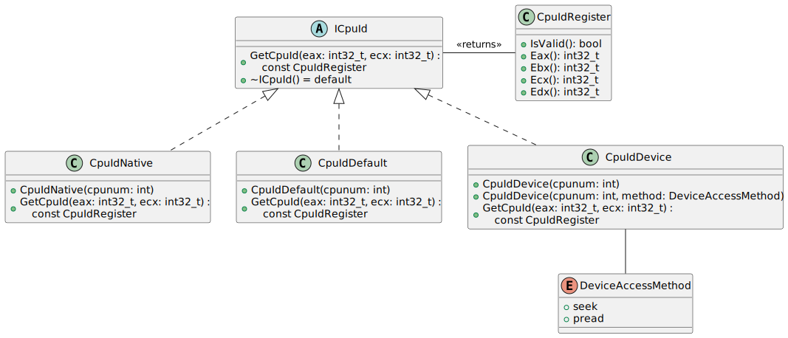
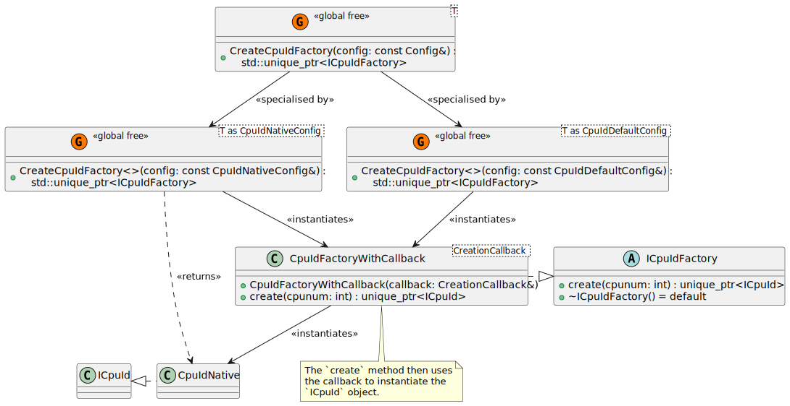

# Design of the CPUID classes and their Factories <!-- omit in toc -->

There are multiple ways to read CPUID data. For x86 platforms, there's always
the most reliable mechanism using the CPUID instruction. The CPUID instruction
returns different data depending on the core that the OS scheduled the thread.

On Linux, there is also the kernel module `cpuid`, which is loaded via the
command `modprobe cpuid`. This presents a number of files in `/dev/cpu/N/cpuid`
which can be seeked to and read with 16-byte chunks to read the same data. This
is independent of the current thread the CPU is running on when the read
operation takes place.

As such, there are multiple ways which one can obtain the results of the `cpuid`
instruction, we should implement many of them and compare them for correctness.

- [1. The CPUID classes](#1-the-cpuid-classes)
  - [1.1. The Default Reader](#11-the-default-reader)
  - [1.2. The Native Reader](#12-the-native-reader)
  - [1.3. The Device Reader](#13-the-device-reader)
  - [1.4. Further Readers](#14-further-readers)
  - [1.5. Readers and UML](#15-readers-and-uml)
- [2. The CPUID Factory Pattern](#2-the-cpuid-factory-pattern)
  - [2.1. Template Design](#21-template-design)
  - [2.2. Benefits of a Template Design](#22-benefits-of-a-template-design)
  - [2.3. Simplest Extension on Current Design](#23-simplest-extension-on-current-design)

## 1. The CPUID classes

### 1.1. The Default Reader

The default reader simply returns a `CpuIdRegister` object that is invalid. This
is useful for testing.

### 1.2. The Native Reader

The native reader pins the current thread on a specific CPU via the Operating
System and executes the `cpuid` instruction, returning the results.

### 1.3. The Device Reader

The device reader opens the device node `/dev/cpu/N/cpuid` and uses the
semantics defined by Linux to get the information.

### 1.4. Further Readers

Further readers may be implemented which can read prerecorded data from a file
in various formats. This is not currently implemented, but the design makes it
simple and robust to extend with further implementations.

### 1.5. Readers and UML

Each `CpuId*` class derives from `ICpuId`. This allows a polymorphic mechanism
to provide any code with a way to get CPUID information, regardless of how it is
obtained, including test code or simulation, and different ways to use a device
to exercise its APIs.

 

The `ICpuId` base class also forms the basis for a factory pattern.

## 2. The CPUID Factory Pattern

Each `ICpuId` derived object only represents a single CPU. Systems today have
typically 2 or more CPUs. Classes should be able to instantiate the objects as
needed through a CPUID *factory*.

The general design:

 

### 2.1. Template Design

Instantiation of the `ICpuIdFactory` is done with the templated free function
`CreateCpuIdFactory()`. The input to the free function is a configuration object
that can be used through *specialisation* to create the correct concrete factory
implementation.

There is one configuration class per concrete implementation of `ICpuId`. The
configuration tags the correct specialisation, as well as allowing source
compatible extensions to be applied for customising further behaviour of the
free function specialisations. The specialisations are provided in the file
`lib/cpuid/cpuid_factory.cpp`.

### 2.2. Benefits of a Template Design

The template design was chosen to take advantage of build time checking. If the
software builds, it is likely correct.

When adding a new concrete class derived from `ICpuId`, one must only provide a
new specialisation of `CreateCpuIdFactory`, the configuration class from
`ICpuIdConfig` and the factory from `ICpuIdFactory`. Note, that no changes are
strictly necessary to existing code, making extending the code local and
potentially avoiding a common bug of forgetting to extend "parent" classes.

### 2.3. Simplest Extension on Current Design

It is not a requirement, but the simplest way to create a new mechanism to
obtain CPUID data is to:

* Create a new concrete class derived from `ICpuId` in a new `.h` and `.cpp`
  file. See `cpuid_default.h` and `cpuid_default.cpp` as an example.
* Create a new specialisation of `CreateCpuIdFactory` in the file
  `cpuid_factory.cpp`. This is the simplest, it is possible to reuse the
  existing code in the unnamed namespace `CpuIdFactoryWithCallback`, and a
  lambda function to create the new `unique_ptr<ICpuId>`.
