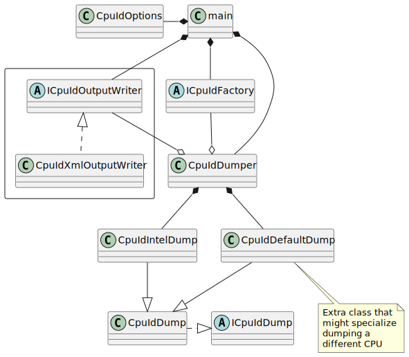

# CPUID Tool for Dumping CpuId Information <!-- omit in toc -->

The tool is designed to dump the CPUID information to the console in XML format,
that is compatible with [CpuIdWin](https://github.com/jcurl/RJCP.DLL.CpuId/). It
has a secondary purpose to test the device API `/dev/cpu/N/cpuid` resource
manager, implemented by this repository, for QNX 7.1.0.

- [1. High Level Requirements](#1-high-level-requirements)
- [2. Design](#2-design)

## 1. High Level Requirements

The tool is intended to be very simple, read the data given by the CPUID
instruction and perform minimal interpretation. By *minimal*, this implies
enough to know how to read the CPUID instructions, but not interpret the
contents any further.

It should have the ability, via the command line, to choose how to read the
CPUID instructions. This will map to the factories given by the template
`CpuIdFactory<T>`.

## 2. Design

The main entry point is the `main` function.

 

To interpret the UML diagram:

* The `main` function creates an `std::ostream`. It gives it to a concrete class
  derived from `ICpuIdOutputWriter`.
* A concrete class derived from`ICpuIdFactory` is created by the main
  application, and is given to the `CpuIdDumper` class, which uses this to
  instantiate an `ICpuId` object, one per CPU.
  * The concrete class to create is determined by the command line option.
  * The `ICpuIdOutputWriter` is also given to the `CpuIdDumper`.
* The `CpuIdDumper` would read the basic register to determine the CPU type via
  CPUID function EAX=0x00000000 (e.g. `AuthenticAMD`, or `GenuineIntel`).
  * If it is either AMD, or Intel, the `CpuIdIntelDump` class is instantiated.
  * Else the `CpuIdDefaultDump` object is created.
* The `CpuIdDumper` uses the `ICpuIdDump` object to iterate through the
  registers and dump the output.
